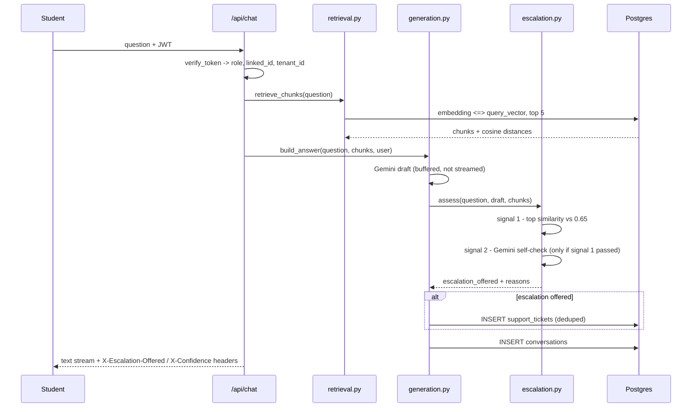
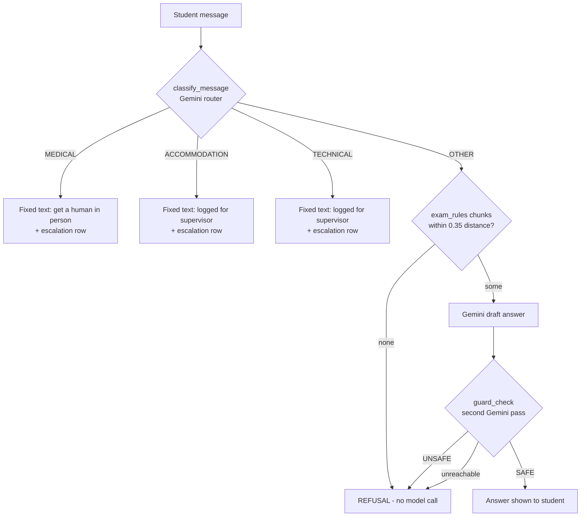

# Architecture

## What this system is

A retrieval-augmented chatbot for a university exam platform, with **three
distinct answering modes** that share one knowledge base and one auth layer but
have deliberately different safety properties:

| Mode | Endpoint | Who | What it may say |
|---|---|---|---|
| General | `POST /api/chat` | student, admin | Anything grounded in the knowledge base; offers a human when unsure |
| Exam / Invigilator | `POST /api/exam/chat` | student, during a live exam | Exam logistics only — never academic content |
| Instructor analytics | `POST /api/instructor/chat` | instructor | Numbers from SQL about that instructor's own exams |

The modes are separate code paths, not one prompt with flags. That is the
central design decision: the invigilator's guardrails cannot be weakened by a
change to the general chat, and the instructor path never touches the vector
store at all.

## Component map

```mermaid
flowchart TB
    subgraph client [Frontend - React]
        UI[Chat UI / Admin panel]
    end

    subgraph api [FastAPI - main.py]
        AUTH[Auth.py<br/>JWT verify -> role, linked_id, tenant_id]
        R1[POST /api/chat]
        R2[POST /api/exam/chat]
        R3[POST /api/instructor/chat]
        R4[POST /api/feedback]
        R5[GET /api/conversations...]
    end

    subgraph rag [RAG]
        EMB[embedding.py<br/>gemini-embedding-001]
        RET[retrieval.py<br/>cosine distance top-k]
        CHK[chunking.py<br/>Q&A-aware splitter]
    end

    subgraph brains [Answering]
        GEN[generation.py<br/>general answer]
        ESC[escalation.py<br/>confidence + self-check]
        INV[invigilator.py<br/>router + guard]
        INS[instructor.py<br/>intent classify]
        ANA[analytics.py<br/>SQL template registry]
    end

    LLM[llm.py<br/>shared Gemini client + retry]

    subgraph db [(PostgreSQL + pgvector)]
        KB[(knowledge_chunks<br/>documents)]
        CONV[(conversations)]
        FB[(message_feedback)]
        TIC[(support_tickets<br/>escalations)]
        ACAD[(exams / results<br/>enrollments / students)]
    end

    UI --> AUTH
    AUTH --> R1 & R2 & R3 & R4 & R5

    R1 --> RET --> KB
    R1 --> GEN --> ESC
    ESC --> TIC
    R2 --> INV
    R3 --> INS --> ANA --> ACAD

    GEN & INV & INS & ESC --> LLM
    CHK --> EMB --> KB
    GEN & INV & INS --> CONV
    R4 --> FB
    FB -.review queue.-> KB
```

## Request flow, general chat



### Why the answer is buffered rather than streamed through

The escalation verdict depends on a self-check over the **finished** answer,
and the client learns that verdict from response headers, which are sent before
the first byte of the body. So the answer has to be complete before the
response starts. `generation.stream_text()` then emits it in 20-character
slices so the frontend's existing reader loop still renders progressively.

The alternative — merging the verdict into the response body — is what the
invigilator's comments record as having previously leaked an `__EVENT__{...}`
string into student-visible text. Metadata travels in headers here for exactly
that reason.

## Request flow, exam mode

The invigilator is a router first and a chatbot second. Three of the four
branches never call a generative model at all:



Two properties worth stating explicitly:

- **Nothing reaches the student unverified.** The draft is fully buffered and
  cleared by `guard_check` before a single character is emitted.
- **The guard fails closed.** If Gemini is unreachable after retries,
  `guard_check` returns `False` and the student gets the refusal. An
  unverifiable answer during a live exam is treated as unsafe.

## Layers of defence

Each mode stacks independent controls, so no single failure is enough:

| Layer | General chat | Exam mode | Instructor |
|---|---|---|---|
| Identity | JWT: role, `linked_id`, `tenant_id` — never client input | same | same |
| Scope | retrieval over all documents | retrieval restricted to `document_type='exam_rules'` | no retrieval; SQL scoped to `tenant_id` + `owner_instructor_id` |
| Pre-model | — | distance cut-off; no chunks ⇒ refuse without calling the model | intent must match one of 4 registered templates |
| Prompt | grounding instruction | invigilator system prompt | analytics system prompt |
| Post-model | self-check ⇒ escalation offer | `guard_check` ⇒ refuse | report writer sees only the returned rows |
| Persistence | conversation + ticket | conversation + escalation | conversation |

## Multi-tenancy

Every identity table carries `tenant_id`, and it is read from the verified JWT
on every request. Analytics queries additionally filter on
`owner_instructor_id`, so an instructor sees only their own exams even within
their own tenant.

> **Known data issue.** `user_info.tenant_id` defaults to `'uet_default'` while
> the `instructors`, `exams` and `students` rows use `'uet'`. The instructor
> login `farrukh` is currently stamped `'uet_default'`, so a real login resolves
> to zero owned exams. This is a data defect, not a scoping defect — the fix is
> `UPDATE user_info SET tenant_id = 'uet' WHERE username = 'farrukh';`

## Module reference

| File | Responsibility |
|---|---|
| `main.py` | FastAPI app, routing, CORS, HTTP status mapping |
| `Auth.py` | signup, login, JWT issue/verify |
| `llm.py` | single Gemini client, retry/backoff, `ModelUnavailable` |
| `chunking.py` | Q&A-aware token chunker |
| `embedding.py` | `gemini-embedding-001`, 3072-dim, retry on 429 |
| `retrieval.py` | vector search; general and exam-scoped variants |
| `generation.py` | general answer, buffered; persists conversation |
| `escalation.py` | confidence scoring, self-check, ticket creation |
| `invigilator.py` | exam-mode router, guard, deterministic hand-offs |
| `instructor.py` | NL → intent → report writing |
| `analytics.py` | the four parameterised SQL templates |
| `conversations.py` | history read APIs |
| `feedback.py` | per-message votes, admin review queue |
| `students.py` | student lookup / prompt context |
| `storage.py` | connection factory |
| `evaluation/` | red-team + hallucination harness |
| `migrations/` | idempotent schema changes |
